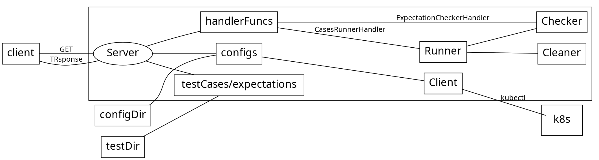

# applifecyce-backend-e2e

[Graph version](https://hackmd.io/mbBSgnYITLmN4W-C0L4DRw)

This repo is set up for testing the following operators:
- [Application](https://github.com/open-cluster-management/multicloud-operators-application)
- [Channel](https://github.com/open-cluster-management/multicloud-operators-channel)
- [Deployable](https://github.com/open-cluster-management/multicloud-operators-deployable)
- [Placementrule](https://github.com/open-cluster-management/multicloud-operators-placementrule)
- [Subscription](https://github.com/open-cluster-management/multicloud-operators-subscription)
- [Subscription-release](https://github.com/open-cluster-management/multicloud-operators-subscription-release)

Initial Set up:
- [x] Channel
- [x] Subscription
- [x] Subscription-release
- [ ] Application
- [ ] Deployable
- [ ] Placementrule

# Design
[Design Doc](https://docs.google.com/document/d/1YEnw_EYrcMzUAR4P2QrNvaQwCq_ogujKl2yoDL8giWo/edit)




# Usage
We setup a web server which provides the following endpoints:

```
{
	"test_id": "helper",
	"name": "registered handler",
	"run_status": "",
	"error": "",
	"details": {
		"/clusters": "show all the registered cluster info",
		"/clusters?id=": "show all the registered cluster info by id",
		"/expectations": "show all the registered expectations",
		"/expectations?id=": "show all the registered expectation by id",
		"/results?id=": "show results by id",
		"/run/stage?id=": "run stage by id",
		"/run?id=": "run test case by id",
		"/stages": "show all the registered stages",
		"/stages?id=": "show all the registered stage by id",
		"/testcases": "show all the registered test cases",
		"/testcases?id=": "show all the registered test case by id"
	}
}
```

As a client, it call run a test case by:
```
http://localhost:8765/run?id=chn-001

{
	"test_id": "chn-001",
	"name": "checked expectations",
	"run_status": "succeed",
	"error": "",
	"details": [
		{
			"test_id": "chn-001",
			"target_cluster": "hub",
			"desc": "should have a channel on hub",
			"apiversion": "apps.open-cluster-management.io/v1",
			"kind": "channel",
			"name": "git",
			"namespace": "ch-git",
			"matcher": "byname",
			"args": {}
		}
	]
}
```

it can check up the specific expectation by:
```
http://localhost:8765/expectations?id=chn-001

{
	"test_id": "",
	"name": "expectations list",
	"run_status": "succeed",
	"error": "",
	"details": [
		{
			"test_id": "chn-001",
			"target_cluster": "hub",
			"desc": "should have a channel on hub",
			"apiversion": "apps.open-cluster-management.io/v1",
			"kind": "channel",
			"name": "git",
			"namespace": "ch-git",
			"matcher": "byname",
			"args": {}
		}
	]
}
```

Also, there's an E2E go suite for travis.

